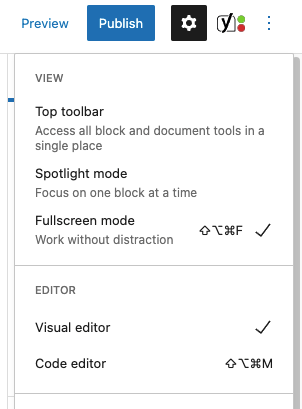
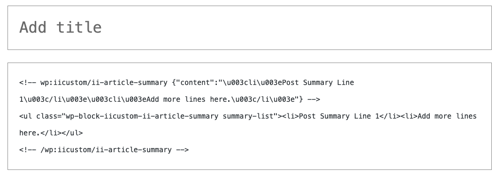

# Adding to WordPress

For version 1.0, the dynamic content widget should be added as plain HTML, there is no visual editor.

1. First set the page/post you’re editing to use the code editor. This menu appears by clicking the 3 dots in the far top right. Select “Code Editor”:

2. Now the main body of the article should appear as HTML:

3. Now you can enter the snippet documented on the next page.