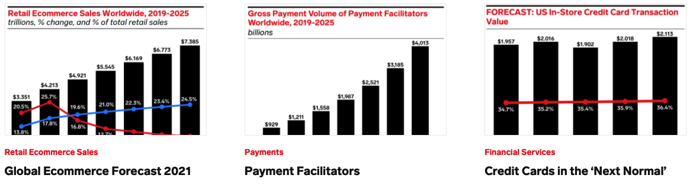

# Examples

This is a collection of real-world examples (existing static content in the Public Site prior to the initial development of this feature) and how you could achieve the same results with the dynamic content block.

### Ecommerce Reports



```html
<div class=”ii-dynamic-content”
	data-type=”asset”
        data-asset-type="report"
	data-primary-topic=”ecommerce-retail”
	data-include-images
	data-count=”3”/>
```

:::tip
Count would be optional because it defaults to 3, but it's generally best practice to supply as many details as you need in case any of the defaults change.
:::

---

### Health Charts


```html
<div class=”ii-dynamic-content”
	data-type=”chart”
	data-primary-topic="health"
        data-include-images
        data-dark-bg
	data-count=”3” />
```

---

### Ecommerce Forecasts


```html
<div class=”ii-dynamic-content”
	data-type=”forecast”
	data-count=”10”
	data-primary-topic=”ecommerce-retail” />

```

--- 
### Reports with Multiple Criteria

_This isn't a real use-case, so there's no image. I wanted to showcase how you could filter by multiple items at once._

```html
<div class=”ii-dynamic-content”
	data-type="asset"
        data-asset-type="report"
	data-count=”3”
	data-primary-topic=”ecommerce-retail”
    data-access-level="locked"
    data-author="karin-von-abrams, barbara-peng"
    data-geography="united states, canada, mexico" />
```

:::note
Only one instance of each attribute can be included at a time. If you want to filter on multiple authors or geographies, separate them by commas. Other properties do not support multiple values, yet.
:::
