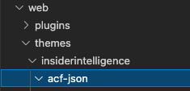
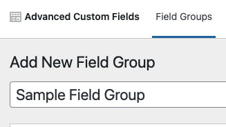
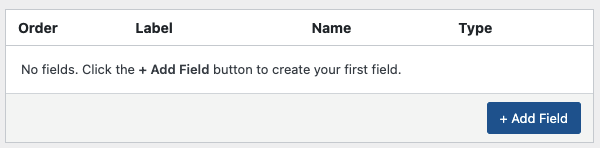
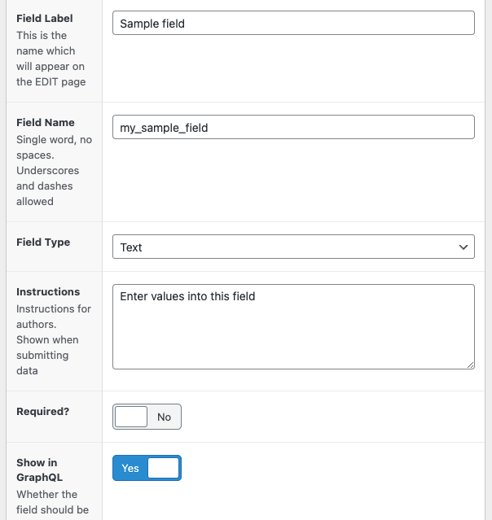
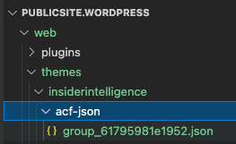

# Custom Fields

We use the Advanced Custom Fields plugin.

:::note
Access to the ACF plugin through the UI requires the admin role.
:::

The added fields will show up in the UI for WP users editing the related content, as well as in the GraphQL payload served up by WPGraphQL.

To keep the code a bit cleaner and easier to read, ACF is configured through the `extensions/acf-*.php` files in the theme directory. These files are then included from `functions.php` like:

```php
require get_template_directory() . '/extensions/acf-posts.php';
```

## Intro

At a basic level we field groups to a data type, then fields are added to the group. For example, in `acf-posts`:

```php
acf_add_local_field_group(array(
    ...
    'graphql_field_name' => 'iiCustomField'
    'fields' => array(
        array(
            ...
            'name' => 'featured_image_source',
            ...
        ),
        array (
            ...
            'name' => 'authors',
            ...
        )
    ),
    'location' => array(
        ...
        'param' => 'post_type',
        'operator' => '==',
        'value' => 'post',
    )
))

```

Breaking it down piece-by-piece:

This is the name of the _group_ as it appears in WpGraphQL

```php
'graphql_field_name' => 'iiCustomField'
```

As you would imagine, these are the fields within the group:

```php
'fields' => array(
    array(
        'name' => 'featured_image_source'
    ),
    array (
        'name' => 'authors'
    )
)
```

And finally, this is where we specify that this group only applies to posts, not pages, authors, or other media:

```php
'location' => array(
    'param' => 'post_type',
    'operator' => '==',
    'value' => 'post',
)
```

The consuming GraphQL in Gatsby could look like this:

```graphql
query {
    post {
        id
        title
        content
        ...
        iiCustomField {
            subTitle
            featuredImageSource
            authors {
                nodes {
                    id
                    name
                    email
                }
            }
        }
    }
}
```

## Using the UI to get all options:

IMO, the easiest way to see all of the available options is to use the UI to configure these fields, then grab out the values.

ACF supports this versioning using a feature called Local JSON.

1. Create a folder in the theme called `acf-json`:

   

1. Use the UI in WP to configure your content:

   
   :::tip
   The field group name doesn't matter. In most cases we'll be adding the field values to an existing group, but you need a placeholder to be able to get to that point.
   :::

1. Now you can start adding the fields you want, with the full UI to make the options a little easier:

   
   then fill in some values:

   

1. Lastly, publish your new field group, and a new file should appear inside the theme:

   

Using common sense, you should be able to easily translate the JSON to PHP:

```json
...
"fields": [
    {
        "key": "field_61795985e6cdd",
        "label": "Sample field",
        "name": "my_sample_field",
        "type": "text",
        "instructions": "Enter values into this field",
        "required": 0,
        "conditional_logic": 0,
        "wrapper": {
            "width": "",
            "class": "",
            "id": ""
        },
        "show_in_graphql": 1,
        "default_value": "",
        "placeholder": "",
        "prepend": "",
        "append": "",
        "maxlength": ""
    }
],
```

```php
array(
    'key' => 'field_61795985e6cdd',
    'label' => 'Sample field',
    'name' => 'my_sample_field',
    'type' => 'text',
    'instructions' => 'Enter values into this field',
    ... etc
)
```

:::caution
Remember to delete the files inside `acf-json` when you're done. The folder can stay (git ignores empty directories), but we don't want to use mixed methods for managing custom fields.
:::
