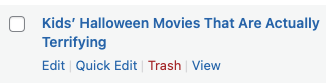

# Redirecting to Gatsby

The WordPress site is locked down to only allow access to the admin section. This is to prevent users from mistakenly trying to view content on the WordPress side, instead of on the Gatsby side.

:::note
This is only applied to "public" pages -- not to anything behind `~/wp-admin/`.
:::

## Redirect Code

Full code is in: `template-parts/common-page.php`

First get the value of the WP domain, such as `https://publicsite-wordpress.development.insiderintelligence.com`

```php
$home = get_option('home');
```

Now compare the request URL and act accordingly.

Any request with a path set means the user is probably, mistakenly trying to access a specific post or page, such as clicking "View" here:


```php
if (home_url($wp->request) != $home) {
    // e.g. https://development.insiderintelligence.com
    $domain = getenv('GATSBY_SITE_DOMAIN');

    // get_permalink is the FULL URL of the request
    // Swap out the WP domain with the Gatsby one
    $final_url = str_replace($home, $domain, get_permalink());

    // And do the redirect
    wp_redirect($final_url);
}
```

Anything at root is probably a user trying to get to the admin side, so redirect for convenience:

```php
else {
    wp_redirect($home . '/admin');
}
```
