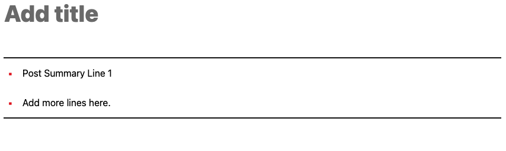

# Filters

One of the core technolgies we take advantages of is [add_filter](https://developer.wordpress.org/reference/functions/add_filter/). From the docs:

> A plugin can modify data by binding a callback to a filter hook. When the filter is later applied, each bound callback is run in order of priority, and given the opportunity to modify a value by returning a new value.

Some examples of how that is used:

## Default Post Content

When a new post is created, it is pre-populated with the article summary:


```php
// Priority = 10
// Number of args = 2
add_filter( 'default_content', 'post_template_summary', 10, 2 );

function post_template_summary( $content, $post ) {
	// We only want the post summary list on posts, not pages.
	if ($post->post_type === 'post') {
		// Use our custom article summary block.
		$content = '<!-- wp:iicustom/ii-article-summary {"content":"\u003cli\u003ePost Summary Line 1\u003c/li\u003e\u003cli\u003eAdd more lines here.\u003c/li\u003e"} -->
<ul class="wp-block-iicustom-ii-article-summary summary-list"><li>Post Summary Line 1</li><li>Add more lines here.</li></ul>
<!-- /wp:iicustom/ii-article-summary -->';
	}
	return $content;
}
```

## Yoast Breadcrumbs

These get modified to include the full URL, instead of just a path.

```php
add_filter('wpseo_breadcrumb_links', 'wpseo__appendbaseurl_breadcrumbs',10,1);

function wpseo__appendbaseurl_breadcrumbs( $this_crumbs ) {
	static $domain_key = 'GATSBY_SITE_DOMAIN';
	if($this_crumbs && null !== getenv($domain_key) && strlen(getenv($domain_key)) > 0){
		$domain = getenv($domain_key);
		if (substr($domain, -1) === '/') {
			$domain = substr($domain, 0, -1);
		}
		foreach($this_crumbs as $key => $crumb){

			if (isset($crumb['url'])){
				$url = parse_url($crumb['url']);
				$this_crumbs[$key]['url'] = $domain . $url['path'];
			}
	    }
	}
    return $this_crumbs;
}
```

## Permalink

The last major thing we use filters for is re-writing the base permalink value. Blog2Social makes heavy use of `get_permalink` as a way to get what URL it should be sharing to social platforms. Rather than sharing a WP link, we need to share the link to the public site.

Whenever a "link" function is called for `post` or `page` entries (realistically the only things we'll share to social media), we can modify the value in use (from `extensions/b2s-getpermalink.php`):

```php
foreach( [ 'post', 'page' ] as $type )
{
	add_filter( $type . '_link', function ( $url, $post_id, $sample ) use ( $type )
	{
		return apply_filters( 'wpse_link', $url, $post_id, $sample, $type );
	}, 9999, 3 );
}

add_filter( 'wpse_link', function($value, $post_id, $sample, $type)
{
	$domain = get_domain();
	$home = get_option('home');
	return str_replace($home, $domain, $value);
}, 10, 4 );
```

:::note
This is a very heavy-handed approach. It is applied to _every call_ for a post or page's permalink value, including GraphQL. To handle that, we need to use [GraphQL Resolvers](./modifying-graphql.md) to fix the GraphQL value before it is served.

The pros out-weigh the cons in the sense that it allows us to upgrade Blog2Social as often as we like without having to modify its source code as we had done previously.
:::
